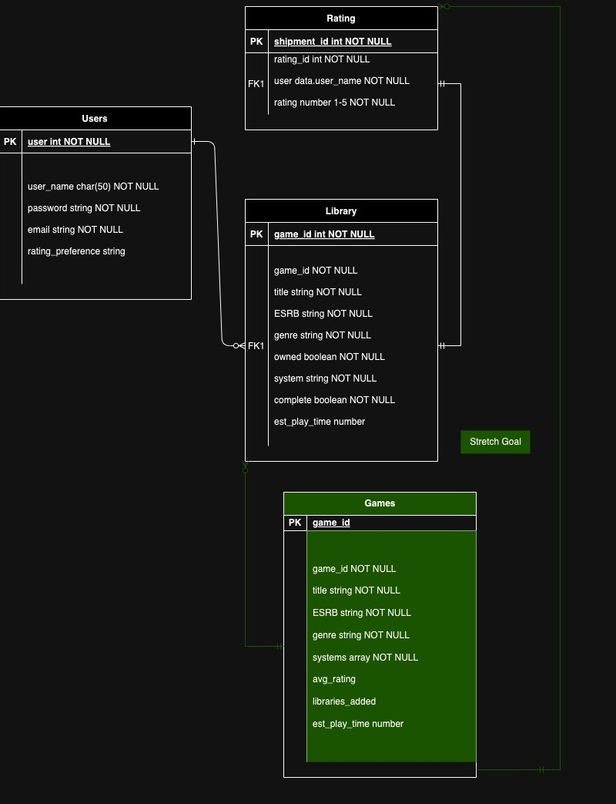
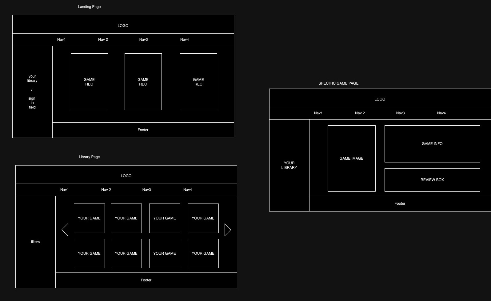
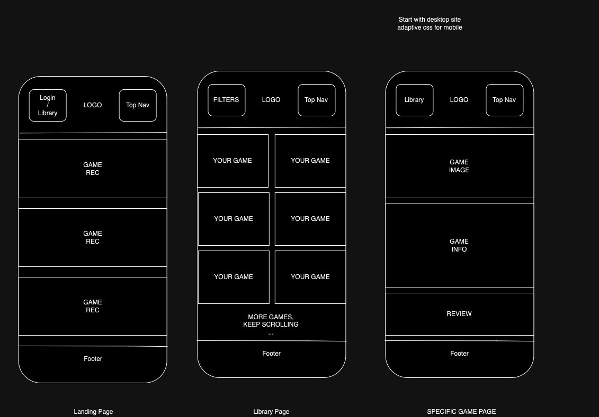

# ralphs-den
### GA project 2 - full stack app
A place to finally catalogue your game library! Now if only it could event more hours for you to finally work through the library. 

## Getting Started
### Whiteboard
- Ability to create user info
- Ability for users to create game info
- Ability to rate games
- Main library lists basic info per user
- Details page that lists detailed info for one game, including reviews
- Ability for users to log reviews on games
- Landing page with a few game suggestions (?) - static suggestions
- Ability to filter through games, eg by console, rating, time owned, etc
- Links to game data (guides, purchase, etc)
- About page, including who the heck is Ralph? 

##### Stretch Goals
- Friend list/other user search functionality
- User profile setting to put rating preferences 
- Public data entity containing games previously posted
- - Ability to suggest game entries to public data entity
- - Landing page has dynamic suggestions, based on public data entity 
- Ability to mark game as complete vs incomplete, or complete, not started, started, DNF(did not finish)
- Games display differently based on above
- Top five games library
- Quick adds - temporary library for games when you dont have ability to fill in all data
- SUPER STRETCH: game reccs based on previous played/owned titles (eg. if you have a lot of turn-based games, it will recommend a random tbg of above a certain review threshold from the public data entity)

### ERD

### Wireframes
 

### User Stories

AAU: Create an account and add my games to my library 
AAU: Review my favorite games 
AAU: Sort my games library by played, system, genre, rating, etc.

